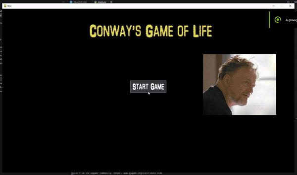

# Conway's Game of Life

Conway's Game of Life is a cellular automaton devised by the British mathematician John Horton Conway in 1970. It is a zero-player game, meaning that its evolution is determined by its initial state, requiring no further input. One interacts with the Game of Life by creating an initial configuration and observing how it evolves.

## How It Works

The game consists of a grid of cells, each of which can be alive or dead. The state of the grid evolves in discrete time steps according to a set of simple rules:

1. Any live cell with fewer than two live neighbours dies (underpopulation).
2. Any live cell with two or three live neighbours lives on to the next generation (survival).
3. Any live cell with more than three live neighbours dies (overpopulation).
4. Any dead cell with exactly three live neighbours becomes a live cell (reproduction).

## Demonstration

<p align="center" >
    
  </p>

## Implementation

The implementation of Conway's Game of Life in this project is done using Python and Pygame. The main components of the implementation are:

- `main.py`: The entry point of the application.
- `game.py`: Manages the game loop, updates, and drawing.
- `algorithm.py`: Contains the logic for Conway's Game of Life.
- `map.py`: Manages the grid and its state.
- `settings.py`: Loads and manages game settings from a YAML file.
- `ui.py`: Manages the user interface.

### Settings

The settings are defined in a YAML file at [`resources/config.yaml`](resources/config.yaml) with the parameters:

- [`background_color`]()
- [`border_color`]()
- [`live_color`]()
- [`fps`]()
- [`resolution`]()
- [`scale`]()
- [`timestep`]() (in milliseconds used to update the screen view with the next iteration)

### Controls

- [`ENTER`](): Start Conway's Game of Life algorithm (you will see a green circle at the upper-right corner)
- [`next ENTER`](): Pause Conway's Game of Life algorithm (you will see a red square at the upper-right corner)
- [`SPACE`](): Stop the game
- [`MOUSE LEFT CLICK BUTTON`](): Select a cell to be alive
- [`MOUSE RIGHT CLICK BUTTON`](): Select a cell to be dead (all cells start as dead)

### Next Steps

- Add a user interface to replace the keyboard controls
- Improve code with some useful Design Patterns (e.g., State Pattern)
- Implement a GPU version of Conway's Game of Life based on the Numba package

## How to Run

1. Create a virtual environment:

   ```sh
   python -m venv venv
   ```

2. Activate the virtual environment:

   - On Windows:
     ```sh
     .\venv\Scripts\activate
     ```
   - On macOS and Linux:
     ```sh
     source venv/bin/activate
     ```

3. Install the required dependencies:

   ```sh
   pip install -r requirements.txt
   ```

4. Run the application:
   ```sh
   python main.py
   ```

## License

This project is licensed under the MIT License.
